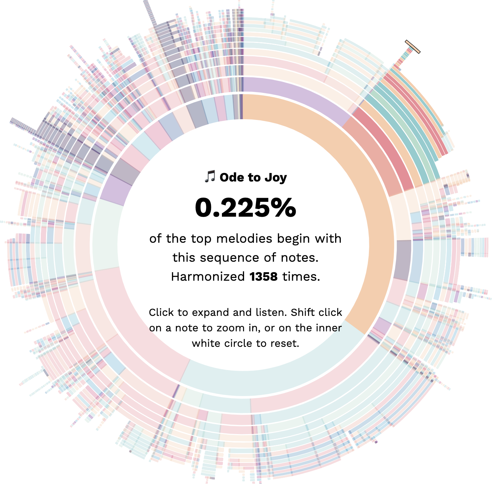
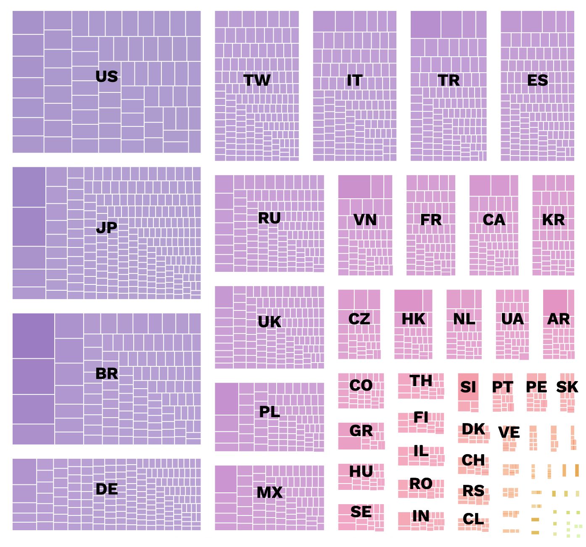

# Bach Doodle Dataset
Over 8 million players have contributed 21.6 millions harmonizations after playing with the Bach Google Doodle.
These harmonizations are a unique data set that can show insights on how
people around the world composed melodies, help developers train new
Machine Learning algorithms, or artists create musical experiences.
That’s why we’re open-sourcing the [dataset](https://magenta.tensorflow.org/datasets/bach-doodle).

This project provides several interactive visualizations to explore this data, such as:

### [Top overall repeated melodies](https://goo.gl/magenta/bach-doodle-viz/overall.html)

### [Top repeated melodies per country](https://goo.gl/magenta/bach-doodle-viz/world.html)

### [Unique regional hits](https://goo.gl/magenta/bach-doodle-viz/unique.html)

----

Explore this [collection of visualizations](https://goo.gl/magenta/bach-doodle-viz) for the dataset, [download the dataset](https://magenta-staging.tensorflow.org/datasets/bach-doodle) or read more about it in the [paper](https://goo.gl/magenta/bach-doodle-paper) it was introduced!
